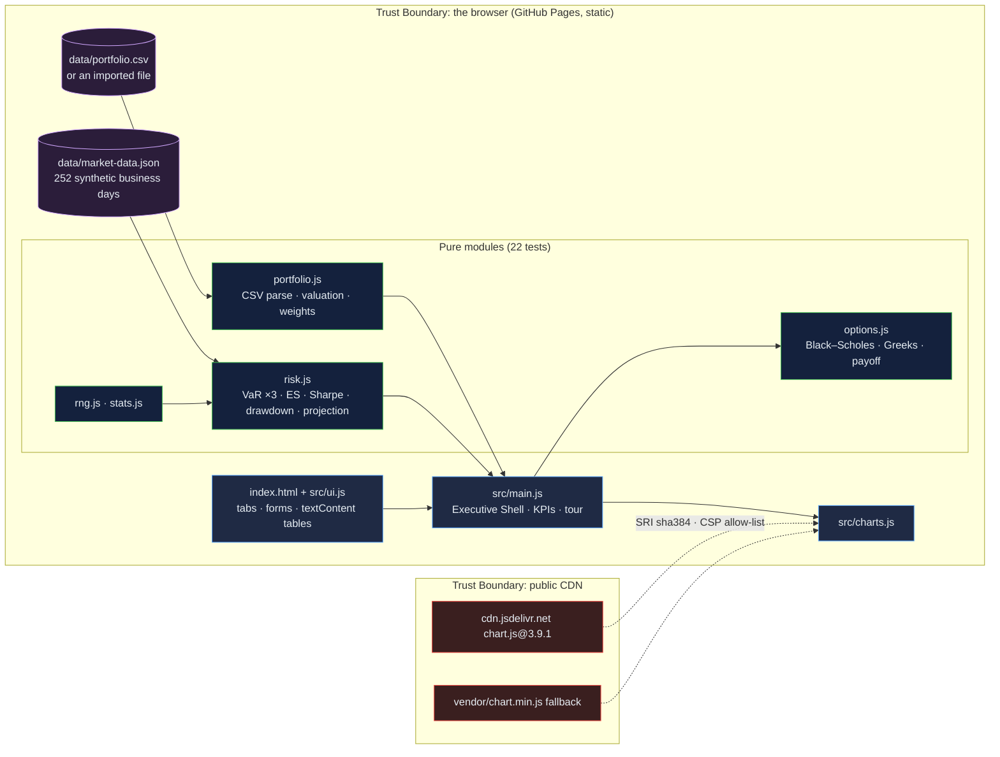

# FinTech Risk Analytics: one portfolio, three Value-at-Risk methods side by side, and the Greeks checked by finite differences

[](https://github.com/Freddricklogan/fintech-risk-analytics/actions/workflows/deploy.yml)
[](#5-getting-started--verification)
[](https://github.com/Freddricklogan/fintech-risk-analytics/actions/workflows/codeql.yml)
[](LICENSE)
[](https://freddricklogan.github.io/fintech-risk-analytics/)

## 1. Executive Summary & Business Impact

**Problem statement.** A risk dashboard is only as good as the data under
it and the method beside it. The previous version of this tool weighted
its VaR with a typed column that disagreed with the holdings it displayed,
computed those figures from a "market history" with weekend rows and
returns that did not match their closes, drew unseeded random numbers, and
rendered CSV fields as HTML. It looked like a risk platform; nothing on it
could be reproduced or defended (`AUDIT.md`).

**Solution & value delivered.** A browser-based risk console that values a
portfolio by market price, computes historical, parametric and Monte Carlo
VaR side by side with expected shortfall, Sharpe and drawdown, projects the
value forward with a seeded GBM and percentile bands beside the closed-form
expectation, and prices options with Black–Scholes Greeks verified against
finite differences. The 252-day history is synthetic, generated by a seeded
script in the repository, labelled as such, and tested for internal
consistency. A holdings CSV can be imported in the browser; rows that fail
validation are listed, never coerced.

**[→ Read the full case study](docs/CASE_STUDY.md)**

| Outcome | How this repo delivers it |
| --- | --- |
| Method is visible | Three VaR figures for one portfolio, each with its assumption stated and its dollar amount |
| Data you can trust the shape of | `scripts/generate-market-data.mjs` regenerates the history; tests assert business days only and return–close consistency |
| Greeks that are right | Delta, gamma, theta, vega, rho tested against central finite differences of the price |
| Your own portfolio | CSV import with a tested RFC-4180 parser, validation messages, and honest handling of symbols with no history |
| Reproducible | Seeded Mulberry32 everywhere; the seed is on the page |

## 2. Demonstrated Competencies & Technical Skills

- **Data Science & AI** — VaR by three methods, expected shortfall,
  Cholesky-correlated Monte Carlo from empirical moments, GBM projection
  with percentile bands, Black–Scholes Greeks, statistical-tolerance tests.
- **Systems Architecture & CS** — pure modules with a separate DOM layer,
  a deterministic data generator committed with its output, Chart.js
  behind a loader with a vendored fallback.
- **Cybersecurity & Compliance** — strict CSP, SRI computed against the
  artifact, no `innerHTML` from user data, CSV symbols validated by
  pattern, CodeQL and Trivy in CI.
- **EdTech & Human-Centered Design** — every method is stated on the page
  in one line; the tour shows the three VaR figures before it shows the
  projection.

## 3. System Architecture & Data Flow



The imported CSV never leaves the browser. No backend, no account, no telemetry.

## 4. Technical Highlights & Engineering Decisions

### ADR-1 — Regenerate the history from a seeded script instead of shipping a file nobody can explain

**Context.** The committed `market-data.json` had 69 weekend dates and 93
returns inconsistent with their closes; its provenance was unknown.

**Decision.** `scripts/generate-market-data.mjs` builds 252 business days
from a seeded, correlated GBM (market factor, sector factor, idiosyncratic
term) and derives returns from closes. The output is committed and a test
checks its shape.

**Consequence.** Every risk figure rests on data whose construction is in
the repository, and the page says it is synthetic rather than implying a
feed.

### ADR-2 — One set of weights, from market value

**Context.** VaR used the CSV's `weight` column while the holdings table
showed market values; the two disagreed.

**Decision.** `valueHoldings()` derives weights from `shares ×
current_price` and every consumer reads them from there. Imported CSVs need
no weight column.

**Consequence.** The portfolio the risk tab measures is the one the
portfolio tab shows.

### ADR-3 — Three VaR methods, with a test that says how close they must be

**Context.** Historical VaR assumes nothing; parametric assumes normal
returns; Monte Carlo draws from the empirical covariance. On jointly normal
data the last two must agree.

**Decision.** `monteCarloVar()` uses a Cholesky factor of the empirical
covariance and `tests/risk.test.js` requires it to match parametric VaR
within 3% on the shipped history.

**Consequence.** The dashboard shows the method difference honestly (on
this data historical VaR sits above the other two), and a regression in
either estimator fails CI.

## 5. Getting Started & Verification

**Prerequisites.** Node 22 LTS. No build step; the page is served from the
repository root.

```bash
git clone https://github.com/Freddricklogan/fintech-risk-analytics.git
cd fintech-risk-analytics
npm ci
npm run lint && npm run validate && npm run coverage
node scripts/generate-market-data.mjs > data/market-data.json   # regenerate the synthetic history
npx serve .    # open http://localhost:3000
```

**Verification — the numbers this repository actually produced:**

```bash
npm run coverage   # 22 passed / 22; All files 99.55% stmts, 93.12% branches
npm run lint       # 0 problems
npm run validate   # html-validate index.html: clean
```

| Check | Result |
| --- | --- |
| Unit tests (Vitest) | **22 passed / 22** across 5 files |
| Coverage (pure modules) | **99.55%** statements, **93.12%** branches (`main.js`, `ui.js`, `charts.js` covered by the browser smoke test) |
| ESLint, html-validate | clean |
| Black–Scholes (S 100, K 100, T 0.25, r 5%, σ 20%) | call 4.6150, put 3.3728; parity to 1e-9; Greeks vs finite differences |
| Shipped data | 15 symbols × 252 business days; returns match closes to 1e-5 |
| Headless Chrome smoke | **0 console errors**; portfolio $243,412, P&L $47,977 (24.55%); VaR 95% hist 2.34% / param 2.08% / MC 2.08%; Sharpe −0.38, max drawdown 20.41% on the synthetic year; projection mean $269,450 vs closed form $269,012; call $4.6150, put $3.3728; four tour steps; no horizontal scroll at 1280 or 400 px |

## 6. Live Demo & Production Showcase

**<https://freddricklogan.github.io/fintech-risk-analytics/>**

**30-second guided walkthrough.** Press **Take the 30-second tour**.

1. **Holdings valued by market price** — fifteen holdings; weights from
   value.
2. **Three VaR figures, one portfolio** — historical, parametric, Monte
   Carlo, with the dollar amount.
3. **Project the value forward** — seeded GBM with percentile bands and
   the closed-form expectation.
4. **Black–Scholes with the Greeks** — switch to the put and keep parity
   on screen.

The synthetic year happened to be a down year for the market factor
(annualised return −2.6%), so the Sharpe ratio is negative; that is what
the data say, and the seed is in the script.
